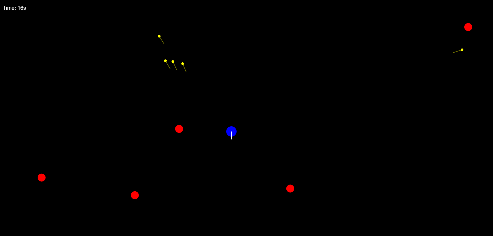

# 🎯 Basic Shooting Game

A lightweight, browser-based shooting game built using **HTML** and **JavaScript** — no frameworks, no build tools.  
Simply open it in a browser and start playing! Perfect for learning the basics of **game loops**, **rendering**, and **player interactions**.

---

## 📸 Game Preview

    

---

## 🎮 Gameplay

- **Objective**: Control the blue player and shoot down enemies (red circles) before they reach you.  
- **Controls**:
  - **Mouse Move** — Aim  
  - **Left Click** — Shoot (fires yellow bullets)  
- **Score / Time**: A timer is displayed at the top left, tracking how long you survive.

---

## 📂 Project Structure

├── index.html # Main HTML entry point
├── game.js # Game logic (rendering, collision, movement)
├── style.css # (Optional) Styling for the page
└── assets/ # (Optional) Media files (images, sounds)

## 🚀 How to Run Locally

**Open in browser:**
- Double-click `index.html`
- Or right-click → **Open with** → select your browser.

✅ No installation, build tools, or dependencies required.

---

## 🛠 Development Notes

- Written in **vanilla JavaScript** — easy to read and modify.
- Uses `<canvas>` for rendering.
- Can be extended with:
  - Score counter
  - Difficulty levels
  - Mobile touch controls
  - High-score tracking (via `localStorage`)
  - Background music & sound effects

---

## 📌 Roadmap

- [ ] Add enemy waves and increasing difficulty
- [ ] Implement health and lives
- [ ] Add restart menu after game over
- [ ] Responsive scaling for different screen sizes
- [ ] Particle effects for explosions

---

## 🤝 Contributing

Contributions are welcome!

1. Fork the repo
2. Create a new branch (`feature/new-feature`)
3. Commit and push
4. Submit a pull request

---

## 📜 License

This project is licensed under the **MIT License** — feel free to modify and share.

---

## 👤 Author

**Mahmoud Hussain**  
🔗 [GitHub Profile](https://github.com/Mahmoud-Hussain)
